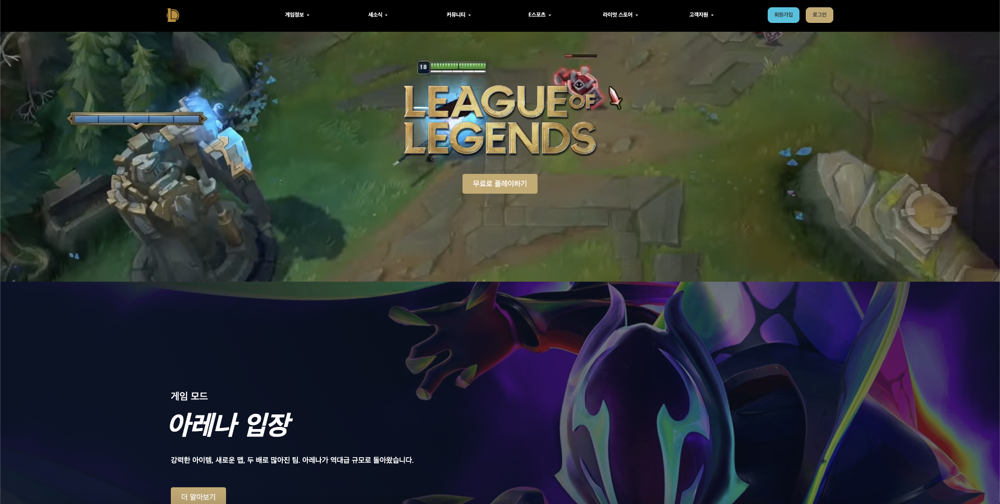

# 프로젝트 제목

## 프로젝트 소개

> 리그오브레전드(https://www.leagueoflegends.com/ko-kr/) 홈페이지를  
> 참고하여 만든 사이트 입니다.

## Stacks

### Skills

### Tools

 

## 사이트

> https://shinjunhyeok.github.io/team-project-lol/dist/

## 기간

> 2024.05.29. ~ 2024.06.13.

## 팀원

## 역할분담 및 기능설명

-   공통
-   이지연
-   이의강
-   신준혁
